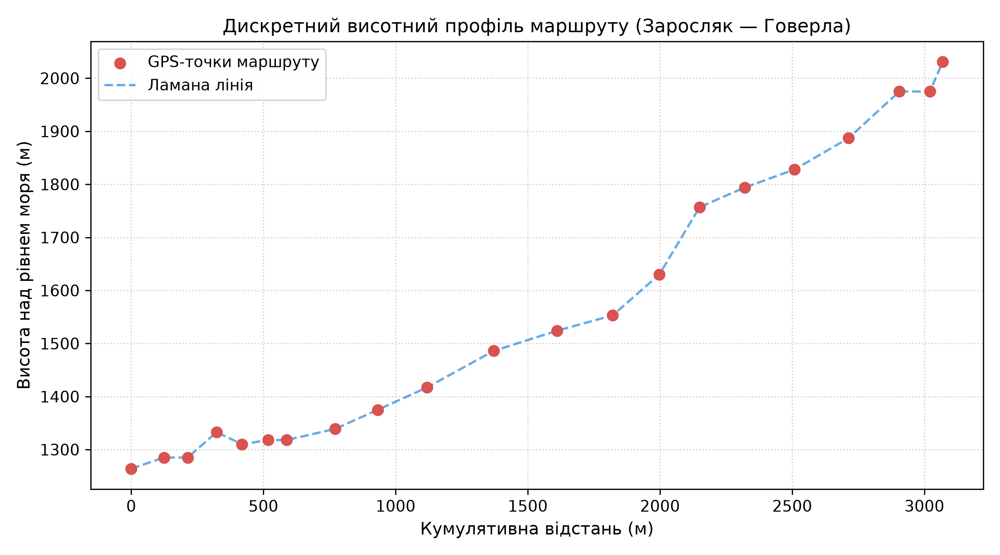
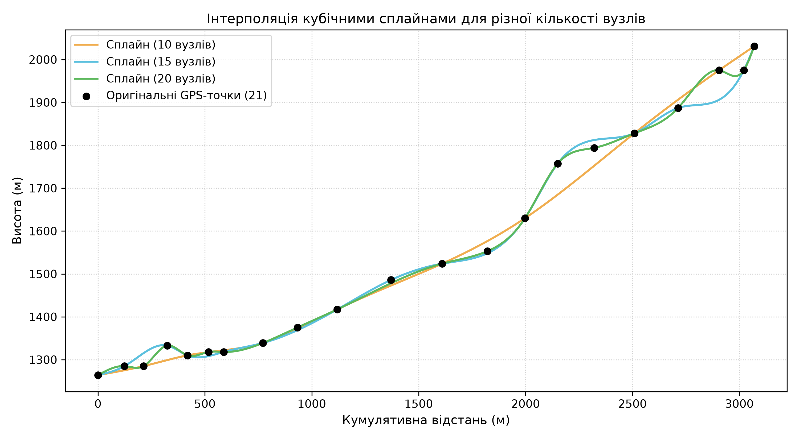
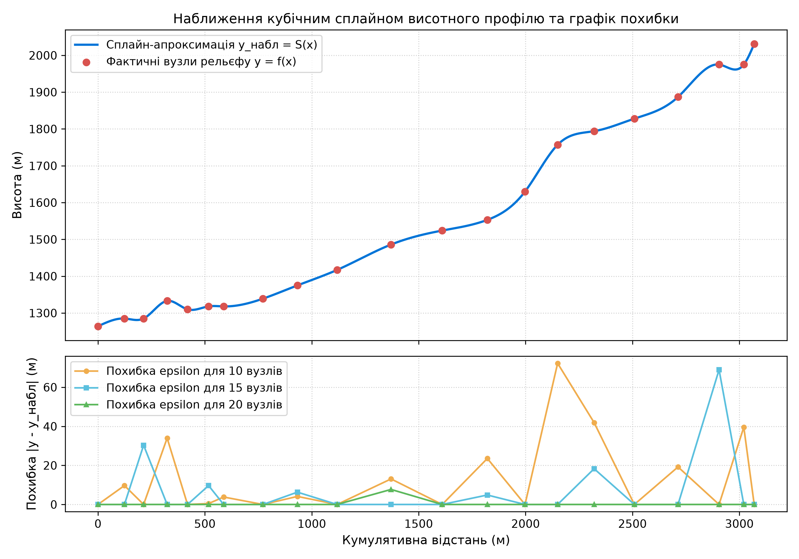
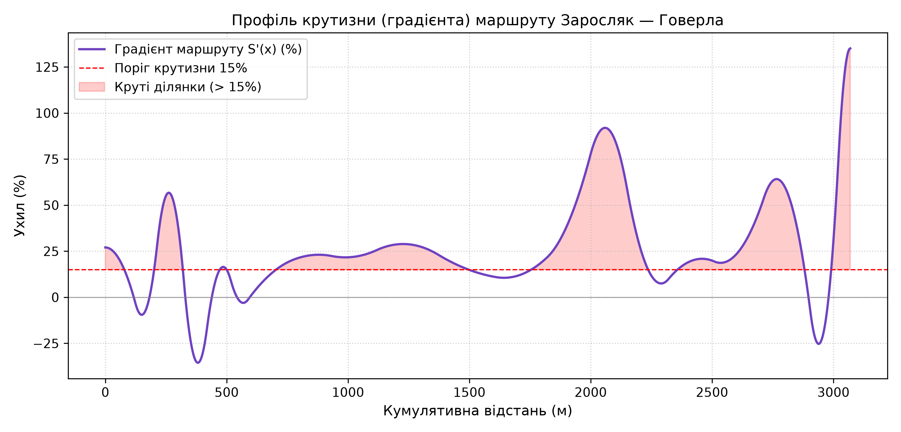

# Лабораторна робота №1: Інтерполяція кубічними сплайнами

**Дисципліна:** Обчислювальні методи та технології  
**Тема:** Інтерполяція кубічними сплайнами та моделювання рельєфу трекінгового маршруту (т/б «Заросляк» — гора Говерла)  

---

## 📌 Опис проєкту

Проєкт присвячено дослідженню та практичній реалізації методу побудови природних кубічних сплайнів ($C^2$-гладкість) для інтерполяції геопросторових GPS-даних. На основі реальних координат висотного профілю від туристичної бази «Заросляк» до вершини гори Говерла побудовано неперервну модель рельєфу, розв'язано тридіагональну СЛАР методом прогонки (алгоритм Томаса), оцінено точність апроксимації при зміні кількості вузлів та розраховано фізико-географічні параметри маршруту.

---

## 📐 Математична модель

На кожному відрізку $[x_{i-1}, x_i]$ ($i = 1, \dots, n$) кубічний сплайн має вигляд:
$$S_i(x) = a_i + b_i(x - x_{i-1}) + c_i(x - x_{i-1})^2 + d_i(x - x_{i-1})^3$$

1. **Коефіцієнти сплайна:**
   - $a_i = y_{i-1}$
   - $d_i = \frac{c_{i+1} - c_i}{3 h_i}$ ($i = 1, \dots, n-1$), \quad $d_n = -\frac{c_n}{3 h_n}$
   - $b_i = \frac{y_i - y_{i-1}}{h_i} - \frac{h_i}{3}(c_{i+1} + 2c_i)$ ($i = 1, \dots, n-1$), \quad $b_n = \frac{y_n - y_{n-1}}{h_n} - \frac{2}{3} h_n c_n$

2. **Тридіагональна система рівнянь для $c_i$:**
   - Граничні умови вільного сплайна: $c_1 = 0$, $d_n = -c_n / (3h_n)$
   - Для внутрішніх вузлів ($i = 2, \dots, n-1$):
     $$h_{i-1} c_{i-1} + 2(h_{i-1} + h_i) c_i + h_i c_{i+1} = 3\left(\frac{y_i - y_{i-1}}{h_i} - \frac{y_{i-1} - y_{i-2}}{h_{i-1}}\right)$$
   - Для останнього вузла ($i = n$):
     $$h_{n-1} c_{n-1} + 2(h_{n-1} + h_n) c_n = 3\left(\frac{y_n - y_{n-1}}{h_n} - \frac{y_{n-1} - y_{n-2}}{h_{n-1}}\right)$$

3. **Розв'язання СЛАР:**
   - Метод прогонки (прямий хід для коефіцієнтів $A_i, B_i$ та зворотний хід для $c_i$) зі складністю $O(n)$.
   - Максимальна нев'язка розв'язку: $\|A c - \delta\|_\infty = 4.44 \times 10^{-16}$ (машинний нуль).

---

## 📊 Основні результати

### 1. Дослідження впливу кількості вузлів на точність (п. 11)

| Кількість вузлів | Max Error (м) | Mean Error (м) | RMSE (м) |
| :---: | :---: | :---: | :---: |
| **10** | 72.26 | 12.46 | 22.80 |
| **15** | 68.95 | 6.59 | 17.13 |
| **20** | 7.69 | 0.37 | 1.68 |

> **Висновки щодо точності:** Збільшення густини сітки з 10 до 20 вузлів знижує середньоквадратичну похибку (RMSE) більш ніж у 13 разів, що підтверджує четвертий порядок збіжності кубічних сплайнів $O(h^4)$. При 10 вузлах сплайн згладжує круті сідловини, а при 20 вузлах забезпечує високу відповідність реальному профілю без осциляцій.

### 2. Характеристики маршруту Заросляк — Говерла

- **Загальна довжина:** $3069.34$ м ($3.07$ км)
- **Сумарний набір висоти:** $790.00$ м
- **Сумарний спуск:** $23.00$ м
- **Максимальний підйом:** $+135.05\%$
- **Максимальний спуск:** $-35.57\%$
- **Середній градієнт:** $27.90\%$
- **Ділянки підвищеної крутизни (> 15%):** $2227.50$ м ($72.6\%$ маршруту)
- **Механічна робота підйому ($m = 80$ кг):** $619.99$ кДж ($148.18$ ккал)

---

## 📈 Графічні матеріали

### Дискретні GPS-точки та висотний профіль


### Порівняння сплайнів для 10, 15 та 20 вузлів


### Профіль рельєфу, наближення та графік похибки


### Градієнтний профіль крутизни маршруту


---

## 📁 Структура репозиторію

```text
.
├── main.py              # Основний скрипт виконання лабораторної роботи
├── requirements.txt     # Список залежностей проєкту
├── tabulation.txt       # Текстовий файл із результатами табуляції (п. 3)
├── Report_Lab1.docx     # Повний оформлений звіт у форматі Word (без води)
├── Report_Lab1.pdf      # Скомпільований звіт у форматі PDF
├── README.md            # Документація проєкту
├── lab1_26.pdf          # Методичні вказівки до лабораторної роботи
├── .gitignore           # Ігнорування віртуального середовища venv/
└── plots/               # Згенеровані графічні матеріали
    ├── profile_discrete.png
    ├── splines_comparison.png
    ├── approximation_error.png
    └── gradient_profile.png
```

---

## 🚀 Запуск проєкту через віртуальне середовище

1. **Створення та активація віртуального середовища (`venv`):**
   - **Linux / macOS:**
     ```bash
     python3 -m venv venv
     source venv/bin/activate
     ```
   - **Windows (PowerShell / CMD):**
     ```powershell
     python -m venv venv
     .\venv\Scripts\activate
     ```

2. **Встановлення залежностей:**
   ```bash
   pip install -r requirements.txt
   ```

3. **Запуск обчислень та побудови графіків:**
   ```bash
   python main.py
   ```

4. **Деактивація середовища (після завершення роботи):**
   ```bash
   deactivate
   ```
