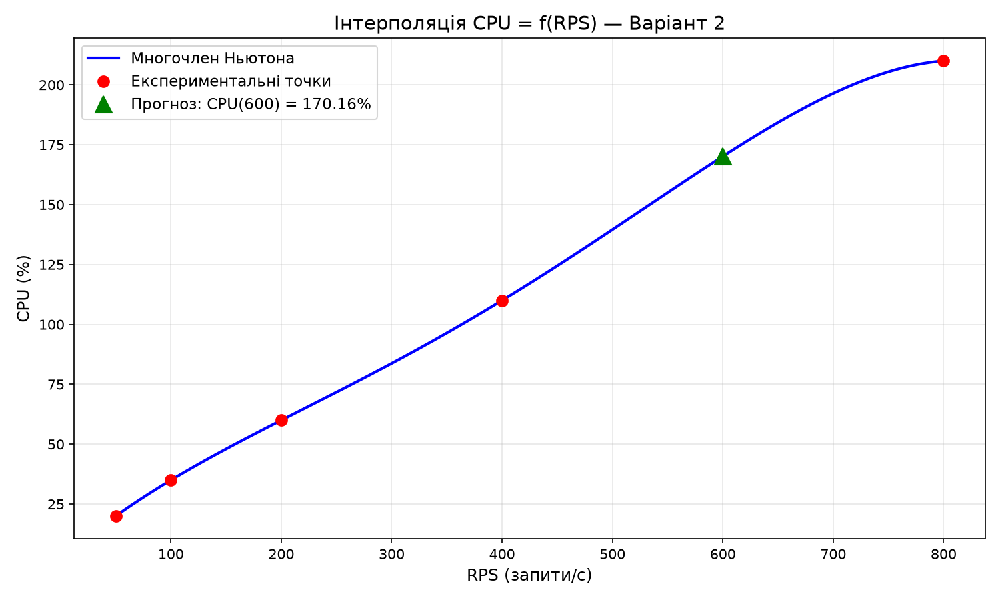
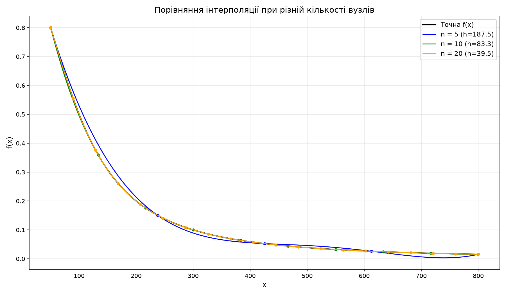
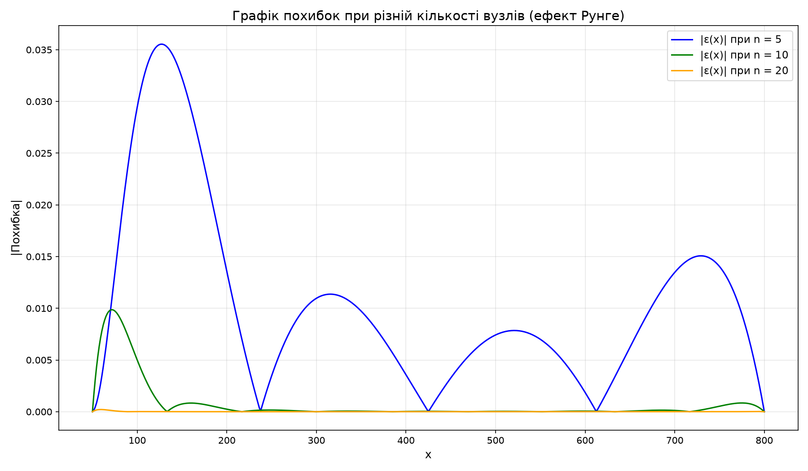
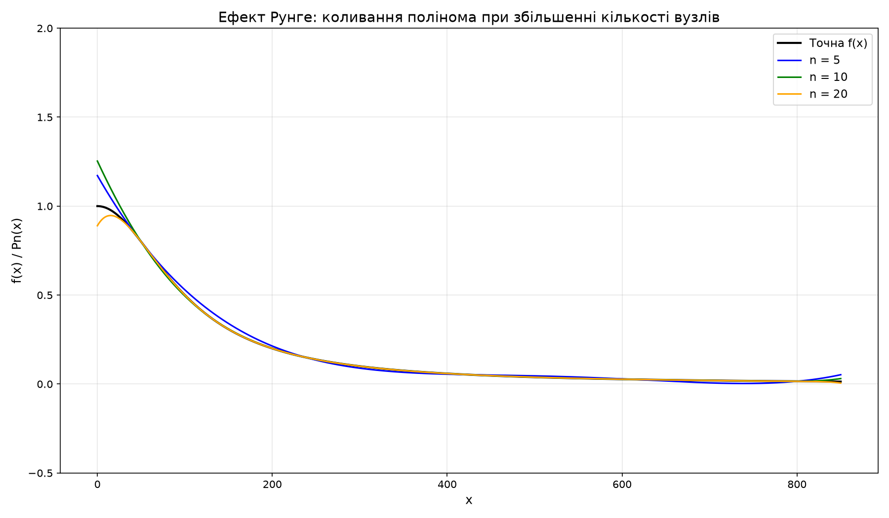

# Лабораторна робота №2

## Тема
Метод інтерполяції з використанням інтерполяційних многочленів Ньютона та факторіальних многочленів.

## Варіант 2 — Планування обчислювальних ресурсів (DevOps)
Прогнозування навантаження на CPU за історичними даними RPS → CPU%.

### Вхідні дані

| RPS | CPU (%) |
|-----|---------|
| 50  | 20      |
| 100 | 35      |
| 200 | 60      |
| 400 | 110     |
| 800 | 210     |

### Що реалізовано
- Побудова таблиці розділених різниць
- Інтерполяційний многочлен Ньютона
- Факторіальні многочлени (для рівновіддалених вузлів)
- Прогноз CPU при 600 RPS
- Дослідження впливу кількості вузлів (n = 5, 10, 20)
- Дослідження впливу кроку та інтервалу
- Аналіз ефекту Рунге

## Структура проєкту
```
Lab2/
├── lab2.py              # основна програма
├── data.csv             # вхідні дані
├── requirements.txt     # залежності
├── report_lab2.docx     # звіт з лабораторної роботи
├── images/              # графіки
│   ├── graph_interpolation.png
│   ├── graph_nodes_comparison.png
│   ├── graph_errors.png
│   └── graph_runge_effect.png
├── .gitignore           # ігнорування venv та кешу
└── README.md
```

## Встановлення та запуск (через venv)

### 1. Створення віртуального середовища
```bash
python3 -m venv venv
```

### 2. Активація віртуального середовища
- **Linux / macOS:**
  ```bash
  source venv/bin/activate
  ```
- **Windows (PowerShell):**
  ```powershell
  .\venv\Scripts\Activate.ps1
  ```
- **Windows (cmd):**
  ```cmd
  venv\Scripts\activate.bat
  ```

### 3. Встановлення залежностей
```bash
pip install -r requirements.txt
```

### 4. Запуск програми
```bash
python lab2.py
```

## Результати

Прогноз CPU при 600 RPS:
- Многочлен Ньютона: **170.16%**
- Факторіальні многочлени: **170.16%**

### Графіки

#### Інтерполяція CPU = f(RPS)


#### Порівняння при різній кількості вузлів


#### Похибки інтерполяції


#### Ефект Рунге

